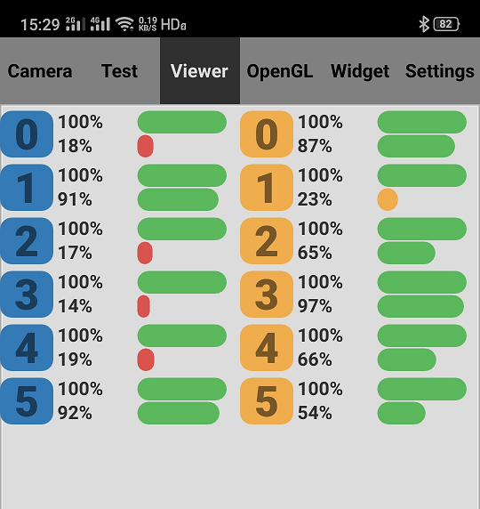

# Octopus

**This is a remote visualization app for robots.  This app can be run on Linux/Windows/Android.**

### Requirement

* Qt5.10
* Python3.5 (optional)

# Features

#### Receive Video from Local Area Network

* Splice UDP packages
* Count FPS and network latency
* Run
```bash
python send.py
```

* Multicast address: 233.233.233.233
* Port: 23333

### Draw Debug Message
* Install **[informer](https://github.com/IamWangYunKai/informer)**, and see [examples](https://github.com/IamWangYunKai/informer/tree/master/examples)
```bash
pip install informer
```


### Render the Dashboard to Display Robot Commands
* See [examples](https://github.com/IamWangYunKai/informer/tree/master/examples) in **[informer](https://github.com/IamWangYunKai/informer)**


#### OpenGL Render
* Render 3D objects (point cloud for example) in a high performance way
* See glitem.h/cpp


#### Widget Render
* Old and traditional way to draw something
* See widgetosritem.h/cpp


#### Sensor Data Viewer
* See viewerinterface.h/cpp


#### Parameters Visualization
* You can modify and save parameters on the interface, but they will only be loaded when you calling:
```c++
ParamManager::instance()->loadParam(param_name, "Visualization String", value);
```
* Save as a local file named "param.ini"
* Press 'R' to reload all parameters from the local file


#### Clock Synchronization
When using **[informer](https://github.com/IamWangYunKai/informer)**, there is an auto-running thread for synchronizing clock by using a protocol like the Network Time Protocol(NTP). Octopus will synchronize clock every second (even if not necessary). See clocsync.h/cpp.

#### Android
* You can install JDK, Android SDK & NDK, Qt Android, and deploy this app on Android device


# TODO
- [x] Multi-machine clock synchronization
- [ ] Point cloud rendering
- [ ] Other demands

# License
MIT License